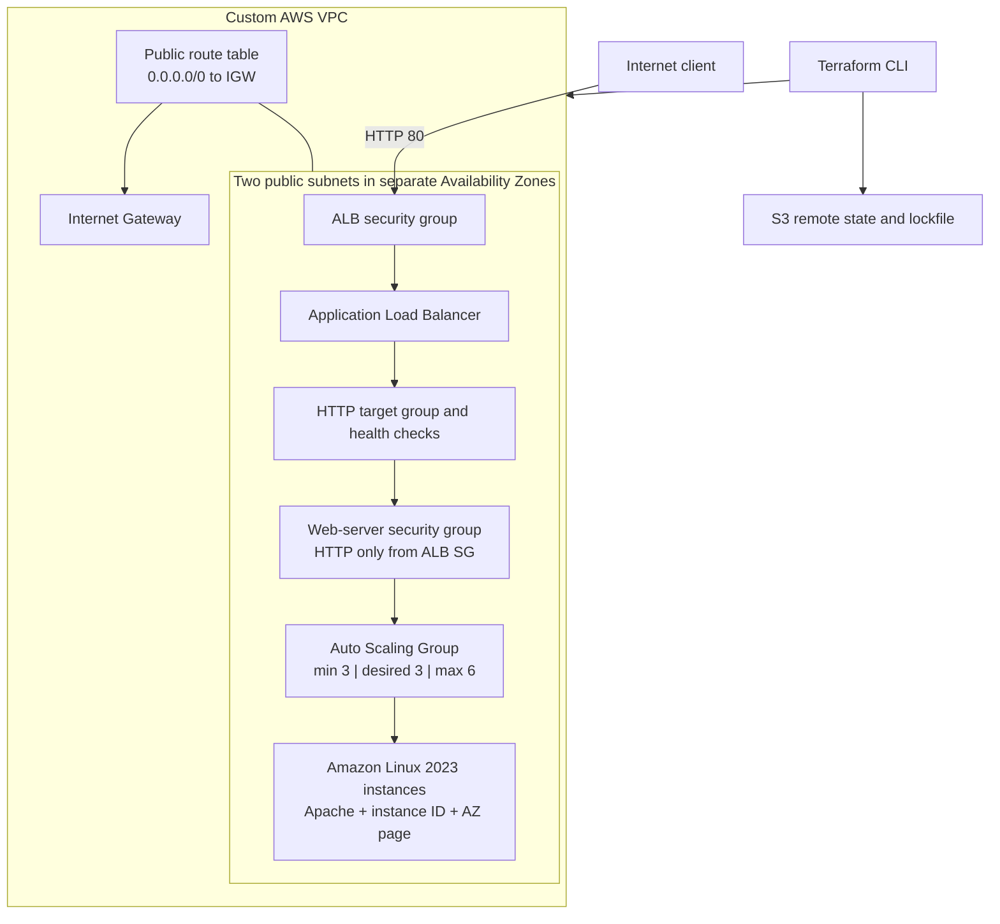

# Scalable Multi-AZ Web Infrastructure on AWS with Terraform

A portfolio project demonstrating a reusable, multi-Availability-Zone AWS web tier built with Terraform.

The configuration creates a custom VPC through a local child module, two public subnets in separate Availability Zones, an internet-facing Application Load Balancer, and an Auto Scaling Group of Amazon Linux 2023 web servers. Each instance installs Apache automatically and serves its instance ID and Availability Zone, making load-balancer distribution directly observable from the browser.

## Architecture



## What This Project Deploys

* One custom VPC created through a reusable local module
* Two public subnets placed in the first two available Availability Zones returned by AWS
* One Internet Gateway
* One public route table with an IPv4 default route to the Internet Gateway
* Route-table associations for both public subnets
* One internet-facing Application Load Balancer spanning both subnets
* One HTTP listener on port 80
* One HTTP target group with application health checks
* One launch template using the latest matching Amazon Linux 2023 x86_64 AMI
* Apache installation and page generation through EC2 user data
* IMDSv2 queries that add the responding instance ID and Availability Zone to the page
* One Auto Scaling Group spanning both public subnets
* Auto Scaling capacity of three minimum, three desired, and six maximum instances
* Automatic target-group registration and Elastic Load Balancing health checks for Auto Scaling instances
* Separate security groups for the ALB and web-server tier
* Web-server HTTP access restricted to requests originating from the ALB security group
* Consistent project, environment, and management tags
* Remote Terraform state in S3 with native S3 lockfile support

## Request Flow

1. A client sends an HTTP request to the ALB DNS name.
2. The ALB security group permits inbound TCP/80 traffic from the internet.
3. The ALB listener forwards the request to its target group.
4. The target group selects a healthy Auto Scaling instance.
5. The server security group permits TCP/80 only when the source is the ALB security group.
6. Apache returns a page containing the selected instance ID and Availability Zone.

## Instance Bootstrap Flow

The launch template supplies base64-encoded user data to every new Auto Scaling instance. At first boot, the script:

1. Installs Apache with `dnf`.
2. Requests an IMDSv2 session token from the EC2 Instance Metadata Service.
3. Retrieves the instance ID and Availability Zone with that token.
4. Writes both values to `/var/www/html/index.html`.
5. Enables and starts the `httpd` service.

This makes the result of ALB routing visible without requiring direct SSH access to an instance.

## Auto Scaling Behavior

The Auto Scaling Group is configured with:

| Setting            | Value | Meaning                                      |
| ------------------ | ----: | -------------------------------------------- |
| Minimum capacity   |     3 | The group should not run fewer than 3 nodes  |
| Desired capacity   |     3 | The group attempts to maintain 3 nodes       |
| Maximum capacity   |     6 | The group may not grow beyond 6 nodes        |
| Health check type  | `ELB` | Target-group health contributes to ASG health |
| Health check grace | 300 s | New instances receive time to finish booting |

The group spans both configured subnets. AWS distributes capacity across the associated Availability Zones; a desired capacity of three across two zones does not mean exactly one instance per subnet.

No target-tracking or step-scaling policy is included. The maximum capacity therefore defines a ceiling, but the group will remain at its desired capacity unless desired capacity is changed or a scaling policy is added.

## Repository Structure

```text
.
├── main.tf                    # ALB, target group, launch template, ASG, data sources, and security groups
├── variables.tf               # Root-module input interface
├── locals.tf                  # Common resource tags
├── outputs.tf                 # VPC, subnet, Availability Zone, and ALB outputs
├── providers.tf               # AWS provider and deployment region
├── versions.tf                # Terraform, AWS Provider, and S3 backend requirements
├── modules/
│   └── vpc/
│       ├── main.tf            # VPC, subnets, Internet Gateway, routing, and associations
│       ├── variables.tf       # Child-module input interface
│       └── outputs.tf         # Child-module network outputs
├── .terraform.lock.hcl        # Recorded provider selection and checksums
└── .gitignore                 # Terraform state, plans, local inputs, and working files
```

## Reusable VPC Module

The local `modules/vpc` child module accepts:

| Input            | Type                                                        | Purpose                                                   |
| ---------------- | ----------------------------------------------------------- | --------------------------------------------------------- |
| `vpc_cidr`       | `string`                                                    | CIDR block assigned to the VPC                            |
| `project_name`   | `string`                                                    | Naming value used by module resources                     |
| `public_subnets` | `map(object({ subnet_cidr = string, subnet_az = string }))` | Stable subnet keys with CIDR and Availability Zone values |
| `tags`           | `map(string)`                                               | Common tags applied to module resources                   |

The module returns the VPC ID and CIDR, Internet Gateway ID, and maps of subnet IDs, CIDR blocks, and Availability Zones. The root module uses these outputs to place the ALB and Auto Scaling Group inside the network without reaching into the child module's internal resources.

## Root Inputs

| Variable         | Type                                   | Default  | Description                               |
| ---------------- | -------------------------------------- | -------- | ----------------------------------------- |
| `vpc_cidr`       | `string`                               | Required | CIDR block for the VPC                    |
| `project_name`   | `string`                               | Required | Project naming and tagging value          |
| `public_subnets` | `map(object({ cidr_block = string }))` | Required | Public subnet CIDRs keyed by stable names |

The AWS provider is currently configured for `us-east-1` in `providers.tf`.

The current root module explicitly maps `public-1` and `public-2` to the first two available Availability Zones. The input uses a map, but adding an arbitrary third key alone will not create a third subnet until the root-to-module transformation is generalized.

Create an ignored local `terraform.tfvars` file:

```hcl
vpc_cidr   = "10.0.0.0/16"
project_name = "terraform-scalable-web"

public_subnets = {
  public-1 = {
    cidr_block = "10.0.1.0/24"
  }
  public-2 = {
    cidr_block = "10.0.2.0/24"
  }
}
```

Real `.tfvars` files are intentionally excluded from Git.

## Outputs

| Output                                    | Description                                      |
| ----------------------------------------- | ------------------------------------------------ |
| `vpc_id`                                  | ID of the created VPC                            |
| `vpc_cidr`                                | CIDR block of the created VPC                    |
| `public_subnet_id`                        | Map of public subnet IDs                         |
| `public_subnet_cidr_block`                | Map of public subnet CIDR blocks                 |
| `public_subnet_availability_zone`         | Map of public subnet Availability Zones          |
| `application_load_balancer_dns_name`      | Public DNS name of the Application Load Balancer |

## Prerequisites

* Terraform `1.15.8` or newer, as declared by the configuration
* AWS Provider `6.60.0`
* An AWS account and an authenticated AWS CLI session
* Permissions to create VPC, EC2, Elastic Load Balancing, Auto Scaling, and security-group resources
* A separately created S3 bucket for the Terraform backend
* An available default service quota for the requested EC2 and load-balancing resources in `us-east-1`

The S3 backend must exist before this project can initialize. The backend bucket and key in `versions.tf` are lab-specific and should be changed before another user deploys the configuration.

Each Terraform project that shares a backend bucket must use a unique `key` so its state remains isolated:

```hcl
backend "s3" {
  bucket       = "<your-terraform-state-bucket>"
  key          = "projects/scalable-web/lab/terraform.tfstate"
  region       = "us-east-1"
  use_lockfile = true
}
```

## Deployment

Authenticate to AWS with an appropriate credential method, such as IAM Identity Center:

```powershell
aws sso login --profile <your-profile>
$env:AWS_PROFILE = "<your-profile>"
```

Initialize the backend and providers:

```powershell
terraform init -reconfigure
```

Format and validate the configuration:

```powershell
terraform fmt -check -recursive
terraform validate
```

Review a saved plan and then apply exactly that plan:

```powershell
terraform plan -out=deployment.tfplan
terraform apply deployment.tfplan
```

## Verification

Retrieve the public ALB DNS name:

```powershell
terraform output -raw application_load_balancer_dns_name
```

Send repeated requests through the ALB:

```powershell
$albDns = terraform output -raw application_load_balancer_dns_name

1..10 | ForEach-Object {
  (Invoke-WebRequest "http://$albDns").Content
  Start-Sleep -Seconds 1
}
```

A successful response contains the responding instance and zone:

```html
<h1>Independent Terraform Project</h1>
<p>Instance ID: i-0123456789abcdef0</p>
<p>Availability Zone: us-east-1a</p>
```

Repeated requests may eventually return different instance IDs and Availability Zones as the ALB distributes traffic among healthy targets.

Inspect target health from the AWS CLI:

```powershell
$targetGroupArn = aws elbv2 describe-target-groups `
  --names alb-tg `
  --region us-east-1 `
  --query "TargetGroups[0].TargetGroupArn" `
  --output text

aws elbv2 describe-target-health `
  --target-group-arn $targetGroupArn `
  --region us-east-1 `
  --query "TargetHealthDescriptions[].{Instance:Target.Id,Port:Target.Port,State:TargetHealth.State,Reason:TargetHealth.Reason}" `
  --output table
```

Verification performed during development included:

* Terraform formatting and validation
* Execution-plan review and successful creation of 18 resources
* Inspection of VPC and subnet outputs
* Confirmation that Auto Scaling instances registered in the target group
* Confirmation that target-group health checks became healthy
* Successful HTTP access through the ALB DNS name
* Browser responses from instances in both configured Availability Zones
* Destruction and recreation during troubleshooting to confirm repeatability

## State and Locking

Terraform state is stored in a separately bootstrapped S3 backend. A project-specific object key isolates this state from other Terraform projects that use the same bucket.

Native S3 lockfile support prevents concurrent Terraform operations from modifying the same state. This is separate from `.terraform.lock.hcl`, which records provider versions and package checksums rather than infrastructure state locks.

The remote-state bucket is intentionally outside this project's normal resource graph and teardown scope.

## Teardown

Create and inspect a complete destroy plan:

```powershell
terraform plan -destroy -out=destroy.tfplan
```

After confirming the planned scope:

```powershell
terraform apply destroy.tfplan
terraform state list
```

Auto Scaling instance termination, target deregistration, ALB deletion, and Internet Gateway dependencies can make teardown take several minutes. Do not interrupt the operation merely because those resources remain in a `Still destroying...` state for a short period.

## Engineering Practices Demonstrated

* Reusable local Terraform modules
* Typed input variables using maps and objects
* Stable resource addressing with `for_each`
* Root-to-child module input transformation
* Child-module outputs and root-module composition
* Data-driven Availability Zone and AMI discovery
* Launch-template-based EC2 provisioning
* Automated Linux bootstrapping with user data
* IMDSv2 token handling and instance metadata queries
* Multi-AZ Application Load Balancing
* Auto Scaling desired-capacity and health-replacement behavior
* Automatic target-group registration through `target_group_arns`
* Security-group references between load-balancer and application tiers
* Remote state isolation and S3 state locking
* Consistent tagging with locals and `merge`
* Plan review, target-health diagnosis, and repeatable deployment testing

## Lab Scope and Production Considerations

This repository is an educational portfolio project, not a production-ready deployment.

The current design intentionally uses:

* Public application subnets and public IPv4 addresses
* HTTP instead of HTTPS
* Broad outbound security-group access
* A fixed AWS region
* Two explicitly mapped subnet keys
* Fixed ALB and target-group names
* A fixed desired capacity without demand-based scaling policies
* A simple Apache demonstration page rather than an application artifact pipeline

A production design would normally consider private application subnets, controlled outbound access through NAT gateways or VPC endpoints, Systems Manager instead of direct instance access, HTTPS with ACM, Route 53, demand-based scaling policies, instance refreshes, CloudWatch metrics and alarms, ALB access logs, centralized logging, automated tests, and CI validation.

## References

* [Terraform S3 backend](https://developer.hashicorp.com/terraform/language/backend/s3)
* [Terraform module syntax](https://developer.hashicorp.com/terraform/language/block/module)
* [Terraform `for_each` reference](https://developer.hashicorp.com/terraform/language/meta-arguments/for_each)
* [Terraform AWS Provider](https://registry.terraform.io/providers/hashicorp/aws/latest/docs)
* [AWS Application Load Balancers](https://docs.aws.amazon.com/elasticloadbalancing/latest/application/introduction.html)
* [AWS Auto Scaling Groups](https://docs.aws.amazon.com/autoscaling/ec2/userguide/auto-scaling-groups.html)
* [AWS EC2 launch templates](https://docs.aws.amazon.com/AWSEC2/latest/UserGuide/ec2-launch-templates.html)
* [AWS EC2 Instance Metadata Service](https://docs.aws.amazon.com/AWSEC2/latest/UserGuide/configuring-instance-metadata-service.html)
